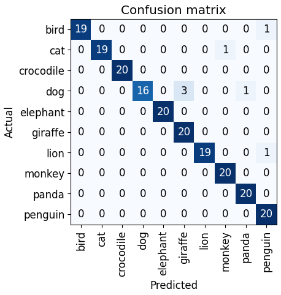

## Confusion Matrices

Confusion matrices are a handy way to evaluate the performance of our model and understand how well it is classifying instances from different classes. In the case of this assignment, we use confusion matrices to represent how well our model is at determining the animal class for the set of images.

Specifically we use it to show how our model uses the training dataset to train itself, and get's more accurate at predicting the class of the image when applied to the test dataset. The confusion matrix can clearly display this improvement, seen below.

Training dataset:

Test dataset:

You can learn more about confusion matrix in machine learning by visiting [this link](https://www.simplilearn.com/tutorials/machine-learning-tutorial/confusion-matrix-machine-learning#:~:text=A%20confusion%20matrix%20presents%20a,actual%20values%20of%20a%20classifier.).
